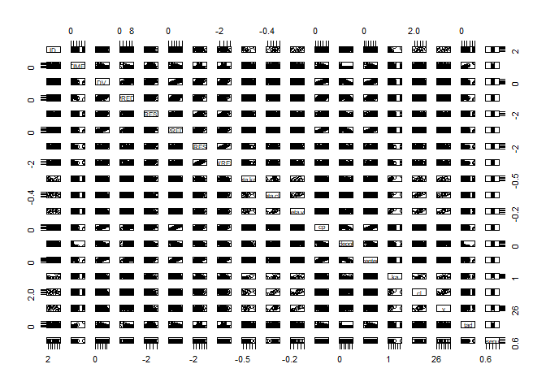

<!-- README.md is generated from README.Rmd. Please edit that file -->

# nlmixr2est: The core estimation routines for nlmixr2

<!-- badges: start -->

[](https://github.com/nlmixr2/nlmixr2est/actions)
[](https://www.codefactor.io/repository/github/nlmixr2/nlmixr2est)
[](https://CRAN.R-project.org/package=nlmixr2est)
[](https://cran.r-project.org/package=nlmixr2est)
[](https://cran.r-project.org/package=nlmixr2est)
[](https://app.codecov.io/gh/nlmixr2/nlmixr2est)

<!-- badges: end -->

The goal of nlmixr2est is to provide the nlmixr2 core estimation
routines.

## Installation

You can install the development version of nlmixr2est from
[GitHub](https://github.com/) with:

``` r
# install.packages("remotes")
remotes::install_github("nlmixr2/rxode2")
remotes::install_github("nlmixr2/nlmixr2data")
remotes::install_github("nlmixr2/lotri")
remotes::install_github("nlmixr2/nlmixr2est")
```

For most people, using nlmixr2 directly would be likely easier.

``` r
library(nlmixr2est)
#> Loading required package: nlmixr2data

## The basic model consists of an ini block that has initial estimates
one.compartment <- function() {
  ini({
    tka <- 0.45; label("Ka")
    tcl <- 1; label("Cl")
    tv <- 3.45; label("V")
    eta.ka ~ 0.6
    eta.cl ~ 0.3
    eta.v ~ 0.1
    add.sd <- 0.7
  })
  # and a model block with the error specification and model specification
  model({
    ka <- exp(tka + eta.ka)
    cl <- exp(tcl + eta.cl)
    v <- exp(tv + eta.v)
    d/dt(depot) = -ka * depot
    d/dt(center) = ka * depot - cl / v * center
    cp = center / v
    cp ~ add(add.sd)
  })
}

## The fit is performed by the function nlmixr/nlmixr2 specifying the model, data and estimate
fit <- nlmixr2(one.compartment, theo_sd,  est="saem", saemControl(print=0))
#> ℹ parameter labels from comments are typically ignored in non-interactive mode
#> ℹ Need to run with the source intact to parse comments
#> → loading into symengine environment...
#> → pruning branches (`if`/`else`) of saem model...
#> ✔ done
#> → finding duplicate expressions in saem model...
#> [====|====|====|====|====|====|====|====|====|====] 0:00:00
#> → optimizing duplicate expressions in saem model...
#> [====|====|====|====|====|====|====|====|====|====] 0:00:00
#> ✔ done
#> using C compiler: 'gcc.exe (GCC) 13.2.0'
#> ℹ calculate uninformed etas
#> ℹ done
#> rxode2 3.0.2 using 8 threads (see ?getRxThreads)
#>   no cache: create with `rxCreateCache()`
#> 
#> Attaching package: 'rxode2'
#> The following objects are masked from 'package:nlmixr2est':
#> 
#>     boxCox, yeoJohnson
#> Calculating covariance matrix
#> → loading into symengine environment...
#> → pruning branches (`if`/`else`) of saem model...
#> ✔ done
#> → finding duplicate expressions in saem predOnly model 0...
#> → finding duplicate expressions in saem predOnly model 1...
#> → optimizing duplicate expressions in saem predOnly model 1...
#> → finding duplicate expressions in saem predOnly model 2...
#> ✔ done
#> using C compiler: 'gcc.exe (GCC) 13.2.0'
#> → Calculating residuals/tables
#> ✔ done
#> → compress origData in nlmixr2 object, save 5952
#> → compress phiM in nlmixr2 object, save 63504
#> → compress parHistData in nlmixr2 object, save 13928
#> → compress saem0 in nlmixr2 object, save 30456

# Since the fit is performed in `nlmixr2est` this code works
print(fit)
#> ── nlmixr² SAEM OBJF by FOCEi approximation ──
#> 
#>  Gaussian/Laplacian Likelihoods: AIC() or $objf etc. 
#>  FOCEi CWRES & Likelihoods: addCwres() 
#> 
#> ── Time (sec $time): ──
#> 
#>         setup covariance saem table compress other
#> elapsed 0.003       0.03 11.5  0.29     0.27 6.787
#> 
#> ── Population Parameters ($parFixed or $parFixedDf): ──
#> 
#>        Parameter  Est.     SE %RSE Back-transformed(95%CI) BSV(CV%) Shrink(SD)%
#> tka           Ka 0.464  0.195   42       1.59 (1.09, 2.33)     71.1   -0.0900% 
#> tcl           Cl  1.01  0.085 8.43       2.74 (2.32, 3.24)     27.4      4.80% 
#> tv             V  3.46 0.0447 1.29         31.7 (29, 34.6)     13.1      8.77% 
#> add.sd           0.696                               0.696                     
#>  
#>   Covariance Type ($covMethod): linFim
#>   No correlations in between subject variability (BSV) matrix
#>   Full BSV covariance ($omega) or correlation ($omegaR; diagonals=SDs) 
#>   Distribution stats (mean/skewness/kurtosis/p-value) available in $shrink 
#>   Censoring ($censInformation): No censoring
#> 
#> ── Fit Data (object is a modified tibble): ──
#> # A tibble: 132 × 19
#>   ID     TIME    DV  PRED    RES IPRED   IRES  IWRES eta.ka eta.cl   eta.v    cp
#>   <fct> <dbl> <dbl> <dbl>  <dbl> <dbl>  <dbl>  <dbl>  <dbl>  <dbl>   <dbl> <dbl>
#> 1 1      0     0.74  0     0.74   0     0.74   1.06  0.0839 -0.477 -0.0849  0   
#> 2 1      0.25  2.84  3.28 -0.437  3.83 -0.991 -1.42  0.0839 -0.477 -0.0849  3.83
#> 3 1      0.57  6.57  5.86  0.715  6.76 -0.194 -0.278 0.0839 -0.477 -0.0849  6.76
#> # ℹ 129 more rows
#> # ℹ 7 more variables: depot <dbl>, center <dbl>, ka <dbl>, cl <dbl>, v <dbl>,
#> #   tad <dbl>, dosenum <dbl>

# But plots are in the helper package `nlmixr2plot`, and therefore:
plot(fit)
```



``` r
# does not give the standard goodness of fit plots
```
